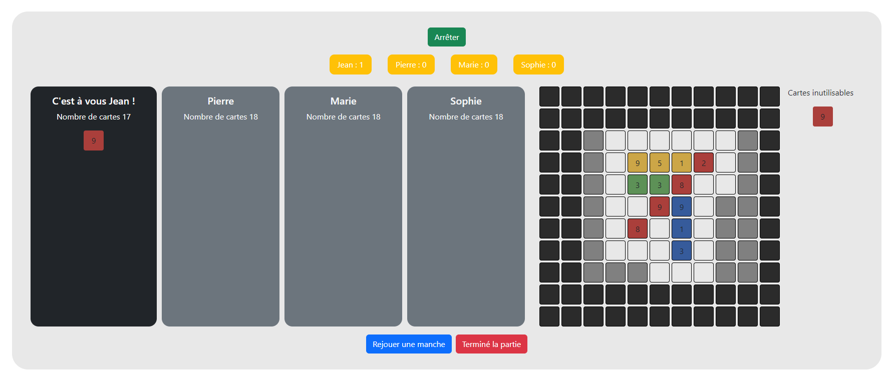

# Punto Project

```
git branch -M main
git remote add origin https://github.com/GourmelenT/punto-project.git
git push -u origin main
```


# Description
Lancer le serveur :
```
npm run start-server
```

Dans un second shell lancer la commande :
```
npm start
```

## But du jeu
- Le but du jeu est de créer une série de cartes de même couleur alignée verticalement, horizontalement ou diagonalement.
- Le nombre de cartes à aligner dépend du nombre de joueurs :

|   Nombres de joueurs   |   Cartes à jouer |
|:-:    |:-: |
|   2   |  5 |
|   3-4   |  4 |

## Comment se déroule une partie ?
 - Une partie de Punto se déroule en 2 manches.
 - À chaque manche, le joueur mélange son paquet de cartes.

## Mise en place
> Une couleur compte 2 séries de cartes numérotées de 1 à 9.
 - À 4 joueurs, chacun choisit une couleur et le paquet de cartes correspondant.
 - À 3 joueurs, la quatrième couleur dite neutre est répartie entre les joueurs.
 - À 2 joueurs, chacun choisit deux couleurs et les paquets de cartes correspondants.

## Comment jouer ?
À son tour, le joueur pose 1 carte.
- Une carte posée peut être juxtaposée à une autre carte par un côté ou par un bout.
-  Une carte posée peut être superposée à une autre carte, si sa valeur est supérieure à la valeur de cette dernière. On dit qu’elle écrase une carte.
Attention ! L’ensemble des cartes doit former un carré de 6 x 6.

## Fin de la manche
- Dès qu’un joueur aligne le nombre de cartes requis, il remporte une manche.
- En cas d’égalité, c’est le joueur qui totalise le moins de points dans sa série qui remporte la manche.
- Le gagnant d’une manche défausse la carte la plus forte de sa série.
- Les cartes restantes sont triées, mélangées et redistribuées.

# Design de l'application :

## Page principale :
L'objectif de cette page est de proposer l'import/export de données d'une base à une autre et de commencer une partie en choisissant le nombre de joueur et la base de données où l'on souhaite insérer les données.


### Ajout de joueur
Comme indiqué dans les règles du jeu, on ne peut jouer que de 2 à 4 joueurs. 


Par la suite, si on n'oublie de sélectionner une base de données ou d'indiquer le nom d'un joueur on obtiendra un message d'erreur comme suit: 


Enfin, si deux noms sont identiques on obtient le message d'erreur suivant : 


## Transfère de données :
Cette page à pour but de transférer les données d'une base de données à une autre.


## Lancement du jeu :
Selon le nombre de joueur on a un affichage différent, mais comme on a ici choisi de jouer à quatre joueurs on a cet affichage. Dans cette partie c'est le premier joueur qui commence à jouer.


### Fin d'une manche :
Lorsque la manche est terminée, on peut voir afficher deux boutons, le bouton `Rejouer une manche` et `Terminer le jeu`. On peut également voir que la carte la plus haute de la ligne de points est mise sur le côté pour montrer quelle carte ne pourra pas être joué à la prochaine partie.



On peut donc choisir de terminer la partie comme suit :

